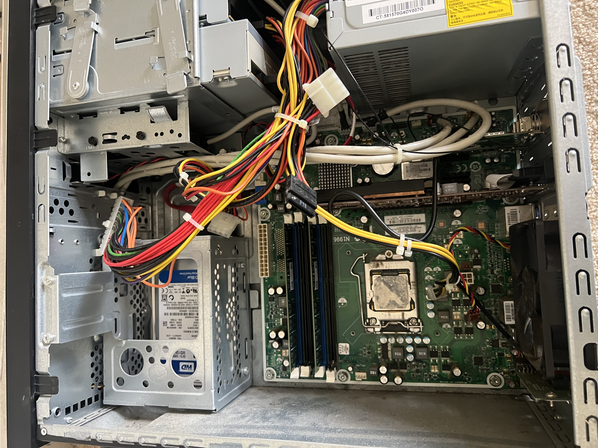
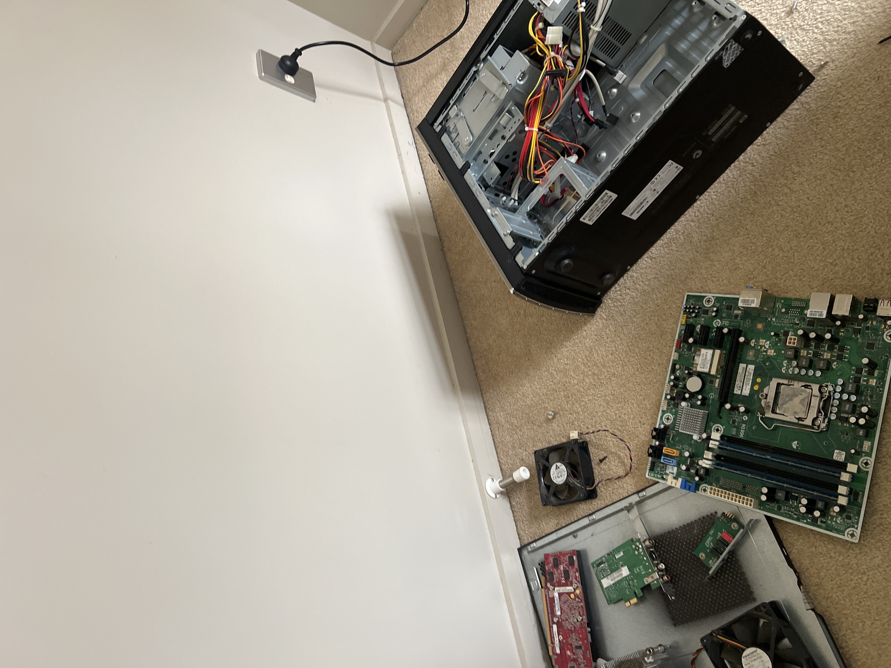
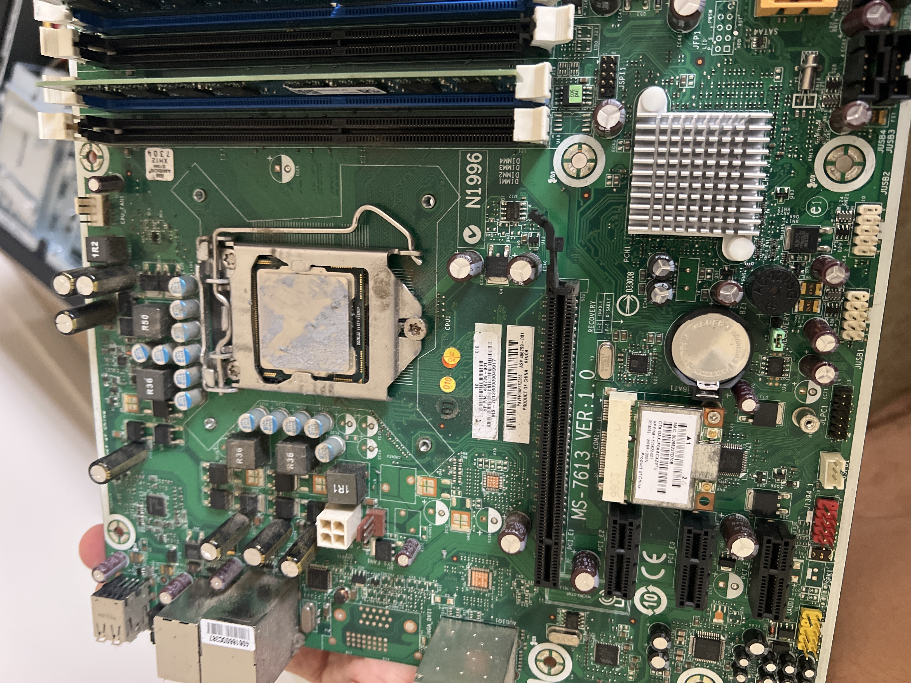

# Lab Log #01: Second-Hand Desktop Teardown and Rebuild

**Date:** Post-Core 1 Exam Prep  
**Objective:** Take a cheap, used second-hand desktop completely apart, clean it, inspect the components, and rebuild it to a fully functional POST state.

## 🖥️ The Donor PC Spec Sheet
I bought a cheap used HP tower locally to mess around with without breaking my main rig. After cracking it open and looking up the motherboard codes, here are the actual specs:
* **Motherboard:** MSI MS-7613 (VER 1.0) - Micro-ATX OEM Board (LGA 1156 Socket)
* **CPU:** Intel Core i5 / i7 (1st Gen compatibility)
* **RAM:** 2x Sticks of DDR3 running in Dual-Channel (Using slots DIMM 1 and DIMM 3)
* **Storage:** 1TB Western Digital Blue HDD (Mechanical, 7200 RPM - Model: WD10EZEX)
* **Expansion:** Dedicated PCIe Graphics Card + PCIe Wi-Fi/Network Card
* **PSU:** Generic OEM non-modular power supply

---

## 🔍 Initial Inspection & Case Layout

*Figure 1: Initial look inside the chassis. Noted the 3.5" Western Digital HDD bracket mounted up top, the dual-stick RAM placement, and the OEM power routing before starting disassembly.*

---

## 🛠️ The Disassembly Process

*Figure 2: The complete teardown layout. Stripped the OEM chassis down completely to isolate the motherboard and inspect individual expansion cards.*

1. **Safety First:** Unplugged the system and held the power button for 10 seconds to drain any leftover power in the capacitors. 
2. **The Rip-Out:** 
   * Disconnected all SATA data cables and the chunky 24-pin ATX power connector.
   * Unscrewed the stock CPU cooler to inspect the thermal interface material.
   * Popped the load lever on the LGA 1156 socket to check for any bent motherboard pins.

*Figure 3: Close-up of the MSI MS-7613 motherboard. The factory thermal paste was completely bone-dry—practically turned to cement and severely degrading thermal performance.*

---

## 🔧 Reassembly & Real-World Troubleshooting

* **The Cleanup:** Used 91% Isopropyl alcohol and a microfiber cloth to fully dissolve and scrub the crusty thermal paste off the CPU integrated heat spreader and the cooler base. 
* **Fresh Compound:** Applied a fresh pea-sized drop of thermal compound right in the middle of the CPU lid and mounted the cooler back down in a cross-pattern for even pressure.
* **The Mistake (Human Error!):** First time I put the RAM back in, I didn't push hard enough on one side. The clip didn't click. 
* **The Result:** When I plugged the monitor in and hit power, the fans spun up, but the screen stayed black. The motherboard gave a repeating memory error beep sequence.
* **The Fix:** Recognised the beep code as a RAM seating issue. Powered down, pulled the memory sticks out, reseated them firmly into the matching slots until both sides clicked, and tried again.

## 📺 Boot Results
Success! After resolving the RAM seating issue, the machine cleared the Power-On Self-Test (POST), loaded into the BIOS successfully, and correctly identified the hardware components and the 1TB storage drive.
